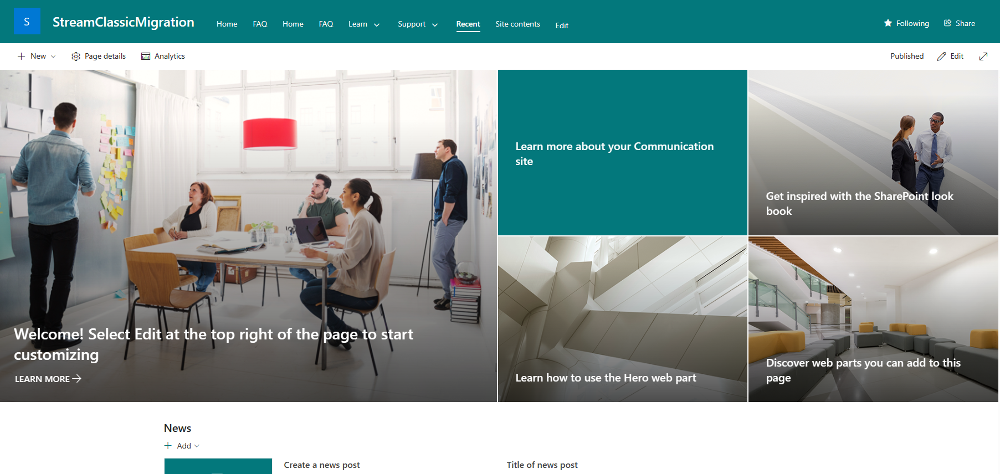

# StreamClassicMigration
Template SharePoint Online Site to help with the migration

This template was generated by using get-pnpsiteTemplate

## Importing the Template

1. Create a new Communications site with any URL you Desire.


2. hoose a template either the StreamTemplateAll or StreamTemplate_limited

 >If you are in a highly secure environment , try the limited template or if you receive any errors on import , manually create the lists and librarys using the exported content.

3.  Connect to the communications site using PNP
```
Connect-PnPOnline -Url "https://contoso.sharepoint.com/sites/StreamClassicMigration" -Interactive


```

More info:
https://pnp.github.io/powershell/cmdlets/Connect-PnPOnline.html#examples

4. Grant PNP Access to the tenant
   
   

5. Run Invoke-pnpsitetemplate

```
Invoke-PnPSiteTemplate -Path C:\temp\template.pnp -ExcludeHandlers SiteSecurity


```


More info:
https://pnp.github.io/powershell/cmdlets/Invoke-PnPSiteTemplate.html#examples 

## Results with the limited Template





### FAQ List view JSON

https://github.com/pnp/List-Formatting/blob/master/view-samples/faq-accordion/faq-accordion.json

Copy this JSON , go to the list Select All Items View , Ensure all the columns are added and group by Question.

Format the view and past the JSON in the advanced section.


### Large files workaround

 Please review the error received when downloading the site template

 https://github.com/pnp/PnP-PowerShell/issues/1897 

 `
 $evidence = New-Object System.Security.Policy.Evidence
$zone = New-Object System.Security.Policy.Zone -ArgumentList ([System.Security.SecurityZone]::MyComputer)
$evidence.AddHostEvidence($zone)
$appDomain = [System.Threading.Thread]::GetDomain()
$securityIdentityField = $appDomain.GetType().GetField("_SecurityIdentity",[System.Reflection.BindingFlags]::Instance -bor [System.Reflection.BindingFlags]::NonPublic)
$securityIdentityField.SetValue($appDomain,$evidence)
 `

 If you run the snippet above -before- you run the Get-PnPProvisioningTemplate /Apply-PnpProvisiongTemplate cmdlets you should be able to retrieve a template with files larger than 10MB. Notice that you only have to run this once during your PowerShell session, e.g. it's not needed to run it before every Get-PnPProvisioningTemplate execution.