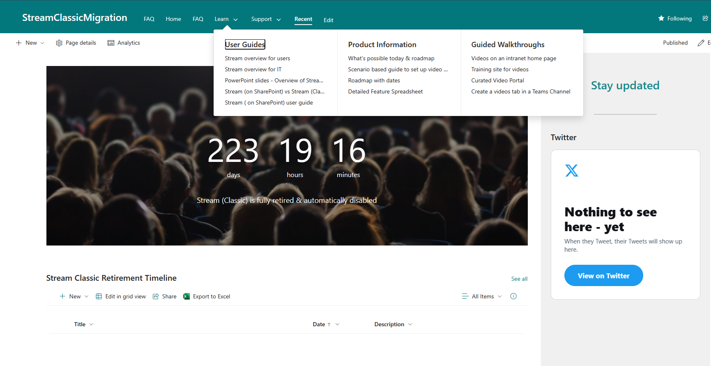

# StreamClassicMigration
Template SharePoint Online Site to help with the migration

This template was generated by using get-pnpsiteTemplate

## Importing the Template

1. Create a new Communications site with any URL you Desire.


2. Download the template StreamTemplate.

 >You may need to manually create the lists and librarys using the exported content.

3.  Connect to the communications site using PNP
```
Connect-PnPOnline -Url "https://contoso.sharepoint.com/sites/StreamClassicMigration" -Interactive


```

More info:
https://pnp.github.io/powershell/cmdlets/Connect-PnPOnline.html#examples

4. Grant PNP Access to the tenant
   
   

5. Run Invoke-pnpsitetemplate

```
Invoke-PnPSiteTemplate -Path C:\temp\template.pnp -ExcludeHandlers SiteSecurity -ClearNavigation


```


More info:
https://pnp.github.io/powershell/cmdlets/Invoke-PnPSiteTemplate.html#examples 

6. Fix the Twitter handle to @MicrosoftStream

## Results with the Template




7. FAQ List view JSON

https://github.com/pnp/List-Formatting/blob/master/view-samples/faq-accordion/faq-accordion.json

Copy this JSON , go to the list Select All Items View , Ensure all the required columns are added and group by Question.

Format the view and past the JSON in the advanced section.
